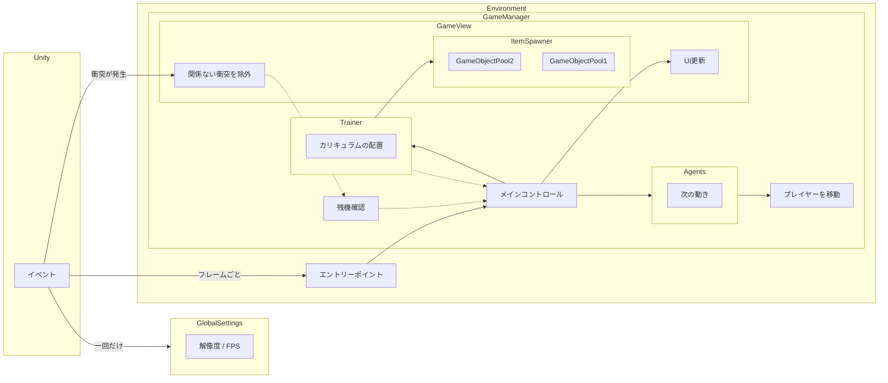

**[English document](README.md)**  
**[中文說明](README.zh-tw.md)**  

# 概要

本プロジェクトは、UnityのAIツールキットをテストするために制作された個人プロジェクトです。AIの能力を測るため、「特訓99」に触発された弾幕ゲームも作り出しました。AIの目標はプレイヤーを操作して、できるだけ長く生き残るために敵弾を避けて、高いスコアを取ることです。

# スクリーンショット

  

ゲームプレイの動画もご覧いただけます：  
新型：[DRLエージェント](https://www.youtube.com/watch?v=XKedSg2ElY0)  
旧型：[ルールベースエージェント](https://www.youtube.com/watch?v=z9VtiN43LhQ)  

# はじめに
本ドキュメントは、このプロジェクトを開発する際に得られた経験について記録しています。弾幕ゲームのAIに興味がある方に参考になったら幸いです。

このプロジェクトには、次の2つのタイプのAIが含まれています：
  - [ルールベースエージェント](#ルールベースのエージェント)
  - [DRLエージェント](#drlエージェント)

## エージェント
人工知能（AI）の分野では、環境の変化を検知し、それに反応する役割は通常、「エージェント」と呼ばれます。例えば、ロボットやゲーム内でプレイヤーが操作するキャラクターなどが該当します。

### ルールベースエージェント
このタイプのエージェントはコードを書くことで作成されます。プログラマーは、ドメイン知識をプログラミングでルールの形として表現しようとします。これはDRL（深層強化学習）に比べて古典的なAIタイプです。

このプロジェクトのエージェントには4つのポリシーが含まれています：
  - 大食い
    - 1-upをもらって、生き残るようにします。
  - ホームシック
    - 隅に近くと追いつめられる恐れがありますので、画面の真ん中に留まることを好みます。
  - 壁フォービア
    - ボーダーラインに触れるとゲームオーバーになりますので、ボーダーラインから離れようにします。
  - 至近距離回避
    - 近距離で敵弾に直面する時、左右に避けようにします。
    - より近い場合は、少し後ずさって、後で左右に回避できる時間を稼ぎます。

各ポリシーは、移動の方向とその方針の自信度の数値を提供します。自信度は、その瞬間の緊急性に依存します。例えば、壁フォービアは、ボーダーラインに近づくにつれて自信度が高まります。

このエージェントは委員会のようなシステムです。最も自信度が高いポリシーを選択し、その方向をゲームシステムに渡します。ちなみに、自信度の関数は実験結果に基づいて選ばれて、理論に基づいたものではないことに気を付けてください。つまり、ある程度人間によって最適化されたものの、完璧に最適化されたわけではないです。

### DRLエージェント
DRLとはDeep Reinforcement Learning（深層強化学習）です。このプロジェクトにあるDRLエージェントはDRLでトレーニングされたエージェントです。使用したツールはUnityの[ML-Agents ToolKit](https://github.com/Unity-Technologies/ml-agents)です。    

### 報酬関数
AIに行動の評価基準を教えることは大事です。それによって、AIはトレーニング中に自己改善ができるようになります。この基準は[報酬関数](https://en.wikipedia.org/wiki/Reinforcement_learning#Introduction)として知られ、DRLの**鍵**とされていますが、適切に設計することは容易ではないとされています。このプロジェクトでは、+1（1-upを取る）、-1（ボーダーラインに当たる）などの基本的な報酬以外に、ボーダーラインや敵弾に近づいくことに対するネガティブな報酬など、ルールベースエージェントからのアイデアを取り入れました。報酬関数でエージェントを誘導する際、[reward hacking](https://en.wikipedia.org/wiki/AI_alignment#Specification_gaming_and_side_effects)という問題を回避するため、[potential-based reward shaping](https://gibberblot.github.io/rl-notes/single-agent/reward-shaping.html#potential-based-reward-shaping)というテクニックも採用しました。詳細な実装については[DRLAgent.cs](Assets/Scripts/AI/DRLAgent.cs)をご参照ください。

DRLのトレーニングを始める前に、ルールベースのようなシンプルなエージェントを用意すれば、DRLのトレーニングが順調に進めます。シンプルなエージェントは、新しくトレーニングされたDRLエージェントの性能を確認するベースラインとして活用できます。さらに、シンプルなエージェントの行動を事前に記録しておいたら、Unityが提供している[GAIL](https://unity-technologies.github.io/ml-agents/ML-Agents-Overview/#gail-generative-adversarial-imitation-learning)と[behavior cloning](https://unity-technologies.github.io/ml-agents/ML-Agents-Overview/#behavioral-cloning-bc)という模倣学習アルゴリズムは、それを利用してエージェントを正しい方向に誘導しつつトレーニング時間を短縮することができます。ただし、模倣学習はトレーニングに干渉する可能性があるため、DRLエージェントが一定の成果を上げたら、模倣学習の強度のパラメータを下げることが推奨されます。  

残念ながら、Unityは[逆強化学習](https://en.wikipedia.org/wiki/Reinforcement_learning#Inverse_reinforcement_learning)のツールを提供していないです。このプロジェクトのルールベースエージェントは既に使えるため、逆強化学習のツールがあれば、報酬関数を直接学習でき、自分で報酬関数を試行する必要がなくなります。

## トレーニングプロセス
### 色々な配置を試して比べましょう
エージェントのパフォーマンスが期待通りでないことはよくあります。残念ながら、その後ろに多くの潜在的な要因（ハイパーパラメータ、報酬関数、不安定な環境など）があるため、問題の根を特定するのは難しいです。そのため、色々な配置を試し、その中でパフォーマンスが優れているのを採用しました。以下に、試した結果です。
  - [アルゴリズム](https://github.com/Unity-Technologies/ml-agents/blob/main/docs/ML-Agents-Overview.md#deep-reinforcement-learning)
    - PPO
      - 他のアルゴリズムに比べて安定しており、使いやすい特徴があります
      - 初心者向け
      - このプロジェクトではこのアルゴリズムを使用しています
    - SAC
      - 試しましたが、Unityの実装は問題があるようです。
      - トレーニング中にある警告が表示され、トレーニングが非常に遅くなりました
      - PPOも同様の警告が表示されますが、遅くなりませんでした
  - ネットワーク設定
    - 2層 + 128ユニット
    - 3層 + 256ユニット
    - 簡単な実験によると、小規模なネットワークの方がより安定し、収束も速いです
  - エージェントの行動
    - プレイヤーは任意の方向に移動できますが、移動を離散化することでトレーニングが高速化できます。
    - x=[-1, 1]、y=[-1, 1]の連続範囲から、時計の12方向に変更し、その上に1つの動かない選択肢を追加し、合計13パターンにしました。
    - 移動距離が大きくなければ、離散的な移動と連続的な移動の結果には大きな違いはありません
  - 報酬関数
    - 基本的な+1/-1に、前述の[potential-based reward shaping](#報酬関数)のテクニックも採用しました
  - バッチサイズ
    - 正直なところ、違いは感じませんでした
    - 大きなサイズ（512）にしました
  - バッファサイズ
    - 大きなサイズ（409600）にしました
      - トレーニング速度は遅くなりますが、より安定します
      - [トレーニング時間](#トレーニング時間)を参照してください
  - トレーニング環境
    - トレーニング専用の特別なレベルを設計し、エージェントに失敗してもすぐ再試行ができるチャンスを提供しました
    - [カリキュラム学習](#カリキュラム学習)を参照してください

### カリキュラム学習
[カリキュラム学習](https://github.com/Unity-Technologies/ml-agents/blob/main/docs/ML-Agents-Overview.md#solving-complex-tasks-using-curriculum-learning)はDRL（Deep Reinforcement Learning）においてよく使用されるテクニックであり、トレーニングの効果を向上させることができます。

このプロジェクトには以下の5つのカリキュラムが含まれています
  - Border  
    - ボーダーラインの場所を理解させます
      - 敵弾がないです
      - エージェントをボーダーラインの近くに配置します
        - 失敗する機会が増えて、「失敗」という概念を早く習得させ、そして避ける方法を覚えらせます
  - Simple
    - 敵弾を避け、1-upを取る方法を教えます
      - 同時に2つのアイテムだけがあります
      - エージェントを画面の中央に配置します
      - エージェントの位置に向けてアイテムを発射します
  - Normal
    - エージェントに多くのアイテムがある環境を慣れさせます。
    - 定期的にアイテムを生成します
    - 画面の中央を中心にランダムにアイテムを発射します
    - 初期ライフを10にします
      - ゲームをすぐ終わらせないようにし、エージェントがさまざまな状況で試すチャンスを確保します
  - Mix
    - エージェントが上記のカリキュラムで学んだことを忘れないようにします
    - 上記のカリキュラムからランダムに1つを今回のトレーニング内容にします
      - [破滅的/破局的忘却](https://en.wikipedia.org/wiki/Catastrophic_interference)の回避策です
        - 根本的な解決策ではありませんが、少し効果があります
      - 各カリキュラムは内容が大きく異なるため、他のカリキュラムよりトレーニングが難しいです
    - このカリキュラムを始める前に、エージェントが上記のカリキュラムの目標をすでに達成したことを確認してください
  - Increasing
    - 本物のゲームの環境です
    - Normalのカリキュラムと似ていますが、さらに難しいです。
    - 時間に伴ってアイテムが増えます
    - 初期ライフを30にします

エージェントは各カリキュラムで収束するまでトレーニングされ、その後次のカリキュラムに進みます。収束の状況は[Tensorboard](https://unity-technologies.github.io/ml-agents/Using-Tensorboard/)で確認できます。

Unityもカリキュラム学習の機能を提供していますが、以下の理由でお勧めしません。
1. Unityのカリキュラム機能はステップ数とレッスン数に基づいて次のカリキュラムに進むかどうかを判断しますが、その二つの基準でトレーニングが収束したことを保証できません。Tensorboardのほうをお勧めします。
2. 破滅的忘却の回避策として、トレーニングしたカリキュラムで再トレーニングすることがあります。
  - 研究者が[一部の解決策](https://pub.towardsai.net/overcoming-catastrophic-forgetting-a-simple-guide-to-elastic-weight-consolidation-122d7ac54328)を提案しましたが、Unityはそれらのアルゴリズムを実装していません
  - 再トレーニングはある程度役に立ちます

したがって、各カリキュラムの[設定ファイル](https://github.com/Unity-Technologies/ml-agents/blob/main/docs/Training-Configuration-File.md#training-configuration-file)を作成すれば使いやすくなります。

### 悪いパフォーマンスとその解決策
SimpleとNormalのカリキュラムでトレーニングした結果、Simpleは思った通りに収束したが、Normalは収束しなかったです。エージェントの行動からして、敵弾と1-upが同時に存在していることは問題点だと推測されました。このような環境で、最適な戦略は敵弾を避けることと、1-upを取ることですが、避けることと取ることはまったく違うポリシーです。Simpleのカリキュラムにアイテムが少ないため、最初から二つのポリシーから一つを選べばよいです。しかし、Normalのカリキュラムにアイテムが多く、1-upを取るときに隣の敵弾にぶつかる可能性があるため、エージェントはこの二つのポリシーの中から速やかに切り替えなければならなく、これがエージェントが明確なポリシーを立てられない理由です。  

この問題を解決するために、トレーニングを2つの段階に分けました。最初の段階では、すべてのカリキュラムに1-upを**取り除き**、収束するまでトレーニングを続けます。この段階では、エージェントは敵弾を避けるスキルを十分に身に付けました。その後、1-upを加えて次の段階のトレーニングをします。エージェントが既に敵弾を避ける経験を持っているため、1-upを取るときに隣の敵弾にぶつかる可能性は低く、結果は最初の段階から1-upを導入するよりも良くなります。

## トレーニング時間
トレーニング時間はプロジェクトの内容によって異なりますが、時間がかかることがよくあります。以下はトレーニングして得た経験です。

PPOのアルゴリズムは2つの段階があります。まずUnityでサンプリングを行い、次に十分なサンプルを取ったらモデルを更新します。
  - サンプリング
    - CPUはUnityの環境を実行します。複数のインスタンスを実行するとき負荷は高いです。
    - GPUはモデルの推論を行います。推論の負荷は低いです
    - このプロジェクトでは、この段階には約2分かかります
    - [トレーニング環境](https://github.com/Unity-Technologies/ml-agents/blob/main/docs/Training-ML-Agents.md#training-using-concurrent-unity-instances)の数を増やせばサンプリングを加速できます
      - デメリットとして、CPUとメモリの使用量が大幅に増えます。
      - トレーニング環境をprefabとして作成し、それを大量にコピーすればトレーニング環境を増やすことができます
        - ただし、プログラムが複数のインスタンスを同時に実行できるようにする必要があります
        - 上記が難しい場合、トレーニング時に`--num-env`を使用して複数のUnityインスタンスを同時に実行することもできますが、理論的にはprefabを使うよりもトレーニングが遅くなります
  - モデルの更新
    - CPUはこの段階でUnityの環境は一時停止し、負荷が低いです
    - GPUは大量の計算をし、負荷が高いです
    - このプロジェクトでは、この段階には約6分かかります
    - 理由はわかりませんが、GPUの使用率は100%に至れないです
      - GPUの使用率が100%未満であれば、複数の異なるトレーニングを同時に実行できます
      - 強化学習には最終結果に影響を与える要因が多くあるため、さまざまな配置を同時に試し、その中から最も良いものを選ぶのはお勧めします。

本プロジェクトで使ったGPUはRTX 3060 12GBです。カリキュラムの難しさによって、トレーニング時間が異なります。以下はいくつかのトレーニングプロセスの記録です。失敗した場合はリストには含まれていません。

1. Border
  - 
  - 220万ステップ
  - 28分

2. Simple
  - 
  - 2000万ステップ
  - 7時間

3. Normal
  - 
  - 3000万ステップ
    - 1000万ステップでほぼ収束し、早期に終われます
  - 10.5時間

4. Mix
  - 画像: 
  - 6350万ステップ
    - 環境が大きく異なるため、収束できませんでした
  - 23時間

5. Increasing
  - 
  - 2.8億ステップ
    - まだ収束していませんでした
  - 実際のゲームで試し、パフォーマンスはルールベースエージェントよりも優れたため、トレーニングを停止しました
  - 120時間
  - トレーニング中にアクシデントが発生しました。
    - パソコンのメモリが食い尽くし、トレーニングが中断され、3回発生しました
    - 再開（resume）すると各数値が大幅に悪化してしまいます
      - 最後の中断（約2.6億ステップ）から元の数値に戻すまで24時間かかりました
      - Unityツールキットの問題かどうかは不明です

### Tensorboard
トレーニングが収束しかを判断し、トレーニングを停止するかどうかを決めることに役立つツールです。

- Environment/Cumulative Reward
  - 報酬関数によって得た数値
  - トレーニングの最終目標はこの数値を最大化することです
    [報酬関数](#報酬関数)述べられたように、この数値にはエージェントに有益な要素（1-upを取るなど）が含まれる可能性がありますが、必ずしも最終目標（生存時間）とは正の相関があるわけではありません
    - これにより、最適化する方向が期待とは異なる可能性があります
    - この数値にエージェントの行動がどのような影響を与えるのか、エージェントは数値が増えるに伴って望む方向に進んでいるのかを明確に理解する必要があります。そうでないと[reward hacking](https://en.wikipedia.org/wiki/AI_alignment#Specification_gaming_and_side_effects)という問題が起こる可能性があります。
  - 実際のデータ  
      

- Environment/Episode Length
  - NormalとIncreasingのカリキュラムでのエージェントが生き残った時間です
  - このゲームの最終目標はできるだけ長く生き残ることであるため、これはエージェントのパフォーマンスを評価する**本物**の基準です
    - 1-upを取って報酬を得られますが、必ずしもエージェントが生き残った時間を延ばすことにつながるわけではありません
      - 例えば、1-upを取るために弾幕に飛び込んで、途中で多くの敵弾にぶつかってしまいます
  - 実際のデータ  
      
    このグラフは、上記のCumulative Rewardの傾向とほぼ同じです。これは最適化の方向が私たちの目標と一致していることを示しています。

カスタムの追加指標を使用することで、問題の診断に役立つことがあります。以下はMix課程のトレーニングプロセスの実際の例です。

- OutofBounds（境界外）
  - 境界にぶつかった場合に+1
    - 低いほど良い
    - トレーニングの間に減少するべきです
    - 実データ  
        
      平均して100万ステップごとに1回未満の発生（浅い青色の線）は、良好なパフォーマンスを示しています。

- Hits（当たり）
  - 任意の種類の弾丸にぶつかった場合に+1
    - 低いほど良い
    - トレーニングの間に減少するべきです
    - 実データ  
        
      最初はエージェントがさまざまな選択肢を探索しているため、パフォーマンスが低いことがありますが、最終的には減少して収束することが成功とされます。

- OneUps（1-up）
  - 1-upを取った場合に+1
    - 高いほど良い
    - トレーニングの間に増加するべきです
    - 実データ  
        
      趨勢は理想的には増加すべきですが、次の指標であるHitsも減少し、その傾向が顕著です。これからの進展において、1-upを収集することよりも弾丸を避けることを優先する可能性があると考えられますが、これは許容できる状況です。

## 実装のデザイン
トレーニングを高速化するために、トレーニング環境（`Environment.cs`）を複数のインスタンスでも実行できるように設計しました。各インスタンスが他のインスタンスに干渉しません。デバッグの負担を減らすために、制御ロジック（`GameManager.cs`）とビューのロジック（`GameView.cs`）が分けられました。
### 構造図

## クレジット
本プロジェクトは以下のツールと素材を使用しました。
- ゲームエンジン
  - [Unity](https://unity.com/)
- 3Dモデル
  - 一部変更：[Low Poly Spaceships](https://sketchfab.com/3d-models/low-poly-spaceships-9177fe4356e4451485dc6129c9904eb9)  
- 背景
  - stable diffusionで生成しました
  - モデル：[Realistic Vision 2.0](https://civitai.com/models/4201/realistic-vision-v20)

## 参考文献
### Unity公式ドキュメント
[Getting Started Guide](https://github.com/Unity-Technologies/ml-agents/blob/main/docs/Getting-Started.md)  
[Making a New Learning Environment](https://github.com/Unity-Technologies/ml-agents/blob/main/docs/Learning-Environment-Create-New.md)  
[Training Configuration File](https://github.com/Unity-Technologies/ml-agents/blob/main/docs/Training-Configuration-File.md)

### 参考文献（上級）
[How to adjust hyper parameters (中国語)](https://zhuanlan.zhihu.com/p/345353294)  
[How to choose DRL algorithms (中国語)](https://zhuanlan.zhihu.com/p/342919579)