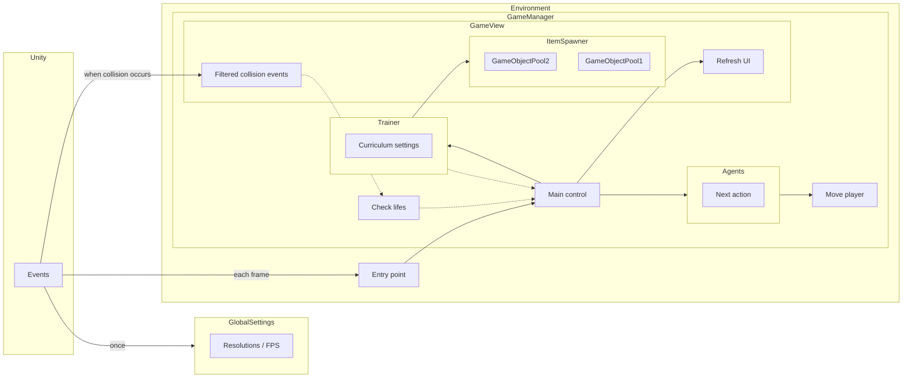

**[中文說明](README.zh-tw.md)**  
**[日本語ドキュメント](README.jp.md)**  

# Abstract
This is a personal project aimed at testing the capabilities of Unity's AI tools. The project includes a bullet hell game inspired by 特訓99, where players must survive through bullets to achieve higher scores. This project also includes two different types of AI which can manipulate player in the game.

# Screenshots

  

Gameplay videos are also available  
Advanced AI: [DRL agent](https://www.youtube.com/watch?v=XKedSg2ElY0)  
Baseline AI: [Rule-based agent](https://www.youtube.com/watch?v=z9VtiN43LhQ)  

# Introduction
This document describes the experiences when developing this project. You may find this document useful if you're interested in bullet hell games.

 In this project, there are two types of AI: 
   - [Rule-Based Agent](#rule-based-agent)
   - [DRL Agent](#drl-agent)

## Agents
### Rule-Based Agent
This agent is made as a baseline so that we can compare performances of different agents. This type is create by writting codes. Programmars try to formulate domain knowledges in the form of rules in programming langugages. It's the old school type AI compare with DRL one. 

The agent in this project including 4 policies:
- Gullutony
  - Tries to get items (1-up) so that player survives longer.
- HomeSick
  - Prefer to stay in the center, since player get less choices of movement in corners.
- BorderRebel
  - Player dies when it touch border line. Keep away from it.
- CloseQuarterDodge
  - Move left/right when facing bullets in close range.
  - If it's even closer then move backward a little bit so that there is enough time to evade by moving left/right later.

Each of them gives a direction and a confidence number as their suggestion. The confidence depends on how urgent it is for the policy. For example, the BorderRebel policy gives higher confidence as the agent gets closer to borders.

This system works somehow like a committee. The agent will choose the policy with highest confidence and return its direction to the game. Note that these confidence functions are chosen based on experiment results and are not based on theories. That means, it's only partially optimized (by human).

### DRL Agent
DRL means Deep Reinforcement Learning. This agent is trained with Unity's [ML-Agents ToolKit](https://github.com/Unity-Technologies/ml-agents)  

### Reward Function
You need to tell agents what are good or bad before training so that they can improve themselves later. These criterions are so called [reward functions](https://en.wikipedia.org/wiki/Reinforcement_learning#Introduction). Although reward functions are the **keys** in DRL but they're also known to be hard to designed. 
For this very project, beside the basic rewards such as +1 (got 1-up), -1 (hit borders), I also borrowed some ideas from the rule-based agent such as negative rewards for getting close to borders and bullets. While introducing such optional rewards for guiding agents, I also used [potential-based reward shaping](https://gibberblot.github.io/rl-notes/single-agent/reward-shaping.html#potential-based-reward-shaping) to make sure it won't cause [reward hacking](https://en.wikipedia.org/wiki/AI_alignment#Specification_gaming_and_side_effects) problems. Please refers to [DRLAgent.cs](Assets/Scripts/AI/DRLAgent.cs) for actual implementation.

Before doing actual DRL training, making some simple agents like the rule-based agent mentioned before might be helpful. They can be used as a baseline to check if your DRL agents work well or not. You can also record their behaviors and use them with imitation learning algorithms such as [GAIL](https://unity-technologies.github.io/ml-agents/ML-Agents-Overview/#gail-generative-adversarial-imitation-learning) and [behavior cloning](https://unity-technologies.github.io/ml-agents/ML-Agents-Overview/#behavioral-cloning-bc). These algorithms help agents finding the correct training direction faster, however, they also will interfere the training process later on. Be sure to lower strengths after DRL agent learned something.  

It's a little sad that Unity doesn't provide [inverse reinforcement learning](https://en.wikipedia.org/wiki/Reinforcement_learning#Inverse_reinforcement_learning) since the rule-based agent is already fairly good and can be used to learn reward function directly so that I don't need to try the best reward function by myself.

## Training process
### Try more setups for comparision
It's pretty common that agents don't perform well as expected. And unfortunately, there're many possible reasons (e.g., hyper parameters, reward functions, unstable environments) behind it and it's really hard to debug it. So what I did is trying many setups and find a proper one from them. These are the setups I tried:
- [Algorithm](https://github.com/Unity-Technologies/ml-agents/blob/main/docs/ML-Agents-Overview.md#deep-reinforcement-learning)
  - PPO
    - It's said to be robust and easier to use
    - Suitable for deep learning beginners
    - This is the one used in this project
  - SAC
    - Tried but gave up because there seemed be to some problems with Unity's implementation
    - After some warning message poped out, the training became unbelievably slow
    - PPO also got same warning but no slow downs
- Network setups
    - 2 layers with 128 units
    - 3 layers with 256 units
    - Smaller networks seem to converge faster and are more stable by experiments
- Actions
  - Also player can move to any direction in theory, discretization helps speeding up training process
  - Discretize From continous movement of x=[-1, 1], y=[-1, 1] to 12 clock positions plus one not moving
  - As long as movements are small enough, it won't cause accuracy problems
- Reward functions
  - From basic +1/-1 to improved potential-based reward shaping [mentioned above](#reward-function)
- Batch size
  - Not really feeling big differences
  - Chose a larger number (512)
- Buffer size
  - Chose a larger number (409600)
    - Slower but stable
    - See [training time](#training-time) for details   
- Environments
  - Design special stages that agents can fail faster and learn faster
  - See [curriculum training](#curriculum-training)
### Curriculum training
[Curriculum training](https://github.com/Unity-Technologies/ml-agents/blob/main/docs/ML-Agents-Overview.md#solving-complex-tasks-using-curriculum-learning) is a common trick in DRL and helps agents learning faster.

There are 5 curriculum in this project:  
1. Border
    - Let the agent knows where borders are
    - No bullets
    - Place the agent by borders before start
        - The agent can receive negative reward immediately thus speeds up training
2. Simple
    - Let the agent know how to evading bullets or collecting 1-ups
    - Only 2 items at the same time
    - Place the agent in the center
    - Shoot items at the agent
3. Normal
    - Let the agent be used to environments with more items
    - Spawn items periodically
    - Shoot items at the center but with random offsets
    - 10 initial lifes
      - Ensure the agent can survive longer and have chances of face more different conditions
4. Mix
    - Make sure the agent still remembers the goals in curriculum 1~3
    - Randomly chooses one curriculum from above
      - A workaround for [Catastrophic Forgetting](https://en.wikipedia.org/wiki/Catastrophic_interference)
        - It doesn't solve the problem but at least helps
      - The environments vary a lot so it's much harder to train in this curriculum
    - Make sure the agent already achieved the goals of all previous curriculums before starting this one
5. Increasing
    - The real game environment
    - Similar to the Normal curriculum but harder
    - Item spawning speed is increased over time
    - 30 initial lifes

The agent is trained with each curriculum until converged and then going on the next one. [Tensorboard](https://unity-technologies.github.io/ml-agents/Using-Tensorboard/) can be used to check if it's converged now.  

Although Unity provides the [curriculum](https://github.com/Unity-Technologies/ml-agents/blob/main/docs/Training-ML-Agents.md#curriculum) function, I prefer not to use it because:  
1. Steps and lessons are not reliable to make sure the agent actually learned something. Use tensorboard instead.
2. Due to Catastrophic Forgetting, you may want to re-train your agents with already trainined curriculum as a workaround.
    - There are [some solutions](https://pub.towardsai.net/overcoming-catastrophic-forgetting-a-simple-guide-to-elastic-weight-consolidation-122d7ac54328) for it but unfortunately Unity doesn't implement them
    - Re-training still works somehow

Maintaining a set of [Training Configuration File](https://github.com/Unity-Technologies/ml-agents/blob/main/docs/Training-Configuration-File.md#training-configuration-file) for different curriculums can be much flexible.

### Bad performance and workaround
When training with Simple and Normal curriculum, although the agent worked good after converged in Simple curriculum, it didn't even converge in Normal one. After observing its behaviors, it can be inferred that the mixture of bullets and 1-ups was the problem. The best policy in these environments is to evade bullets and collect 1-ups, though evading and collecting are totally opposite policies. The agent worked well in Simple curriculum because there were only few items and it only have to choose from evading or collecting. But since there were more items in Normal curriculum, collecting 1-up may end up being hit by bullets nearby, the agent have to switch between 2 very different policies, and make it unable to develop concrete policies.  
To solve this problem, the training was splitted into 2 rounds. In the 1st round, **1-ups were removed from the environments**. After the agent completed all curriculum in the 1st round, it got excellent skill of evading bullets. Then the agent was trained with 1-ups in the environments in the 2nd round. Because it already learned how to evade bullets, it was more likely to collect 1-ups without being hit. By doing this, the final result will be better than just training with 1-ups in one round.

### Training time
Training time depends on your project. But usually it takes some time. The followings are the experiences I got when training with this project.  

PPO algorithm is divided by two stages, sampling and model updating. In each iteration, first get samples from Unity environments and then update model with sampled datas.
- Sampling
  - CPU works for executing Unity environment. High loading when executing multiple instances.
  - GPU works for model inferences. Inference itself is low loading.
  - For this project, it took about 2 minutes for this stage
  - This step can be speedup by using more [environment instance](https://github.com/Unity-Technologies/ml-agents/blob/main/docs/Training-ML-Agents.md#training-using-concurrent-unity-instances)
    - It will use more hardware resources, especially for CPU and RAM
    - Make the training environment as a prefab and duplicated them in the main scene
      - Make sure your code can be run with multiple instances
      - Otherwise, you can use `--num-env` instead when training to run multiple Unity instance though it will be slower in theory
- Model updating
  - Low CPU loading since Unity environments were suspended
  - High GPU loading for tensor computations
  - For this project, it took about 6 minutes to complete
  - Not knowing why, GPU utilization was only about 50%
    - You can run more than one training as long as it's below 100%
      - Since there're many factors affecting the final result, it's a good idea to test more setups and compare with them

RTX 3060 12GB is used for training this project. The training time varies among curriculums due to the difficulties.  
The followings are the progress records of some trainings. Failed trainings are not included.
1. Border
  - 
  - 2.2M steps
  - 28 minutes
2. Simple
  - 
  - 20M steps
  - 7 hours
3. Normal
  - 
  - 30M steps  
    - Actually already converged around 10M
  - 10.5 hours
4. Mix
  - 
  - 63.5M steps
    - Not really converging due to the difference of mixed environments
  - 23 hours
5. Increasing
  - 
  - 288M steps
    - Still not converged
    - The performance of the agent is already better than rule-based agent after 200M
  - 120 hours
  - There were some accidents during this training
    - My PC ran out of memory and the training was interrupted 3 times
      - Each time the numbers dropped significantly after resume
        - It took 24 hours to fully recover
        - Not sure if it's the problem of Unity's toolkit or not

### Tensorboard
Tensorboard is useful for determinine whether trainings are converged and then deciding whether to stop training or not. The following figures are the metrics when training with Mix curriculum.
- Environment/Cumulative Reward
  - The value gained by reward function
  - Training process will try to maximize this metric
    - As mentioned in [reward function](#reward-function), this metric may contains some factors (e.g. getting 1-ups) that are irrelevent to the final goal (surviving time)
    - This may result in misalignment in Unity's tookit and your final purpose
    - You need to understand what agents really did and contributed to this metric. You need to make sure agents really start to do what you want them to do as this metric grow. Otherwise it may resulting in [reward hacking](https://en.wikipedia.org/wiki/AI_alignment#Specification_gaming_and_side_effects).
  - Example  
      
- Environment/Episode Length
  - Means how long an agent survive in Normal and Increasing curriculum
  - This is the **real** metric of how well an agent play, since our final goal is to survive longer
    - Getting 1-up will earn more reward, but not necessarily letting agent survive longer
      - It's not worthy to get a 1-up surrounded by bullets and then get hit
  - Example  
      
    This figure is almost the same as the Cumulative Reward, and it's good. This means the agent was being optimized in the way we want

Some [custom metrics](https://github.com/Unity-Technologies/ml-agents/blob/main/docs/Using-Tensorboard.md#custom-metrics-from-unity) were also introduced to help diagnosing problems.
- OutofBounds
  - +1 When hitting border
  - Lower is better
  - Should be decreasing
  - Example  
      
    It's good that it occured less than once per millon steps (light blue lines in the background).
- Hits
  - +1 When hit by any type of bullets
  - Lower is better
  - Should be decreasing
  - Example  
      
    The agent was exploring at the beginning so it didn't perform well. But it's good as long as it's decreasing and converged in the end.
- OneUps
  - +1 When collecting 1-up
  - Higher is better
  - Should be increasing
  - Example  
      
    It's not ideal because it's decreasing. But at the same time hits are also decreasing so it can be infered that the agent may want to evade bullets first. It's acceptable in this case.

## Design of implementation
To speed up training, this project is designed to be able to run with more than one environment instance (`Environment.cs`). Some efforts were made to make sure each instance doesn't interfere with others.  
To make debugging easier, control logics (`GameManager.cs`) were seperated from view logics (`GameView.cs`). 
### Architecture overview

## Credits
This project used the following tools and assets
- Game Engine
  - [Unity](https://unity.com/)
- 3D models
  - Modified from: [Low Poly Spaceships](https://sketchfab.com/3d-models/low-poly-spaceships-9177fe4356e4451485dc6129c9904eb9)  
- Background
  - Generate with stable diffusion
  - Model: [Realistic Vision 2.0](https://civitai.com/models/4201/realistic-vision-v20)
## References
### Unity offical documents
[Getting Started Guide](https://github.com/Unity-Technologies/ml-agents/blob/main/docs/Getting-Started.md)  
[Making a New Learning Environment](https://github.com/Unity-Technologies/ml-agents/blob/main/docs/Learning-Environment-Create-New.md)  
[Training Configuration File](https://github.com/Unity-Technologies/ml-agents/blob/main/docs/Training-Configuration-File.md)

### Advanced references
[How to adjust hyper parameters (Chinese)](https://zhuanlan.zhihu.com/p/345353294)  
[How to choose DRL algorithms (Chinese)](https://zhuanlan.zhihu.com/p/342919579)