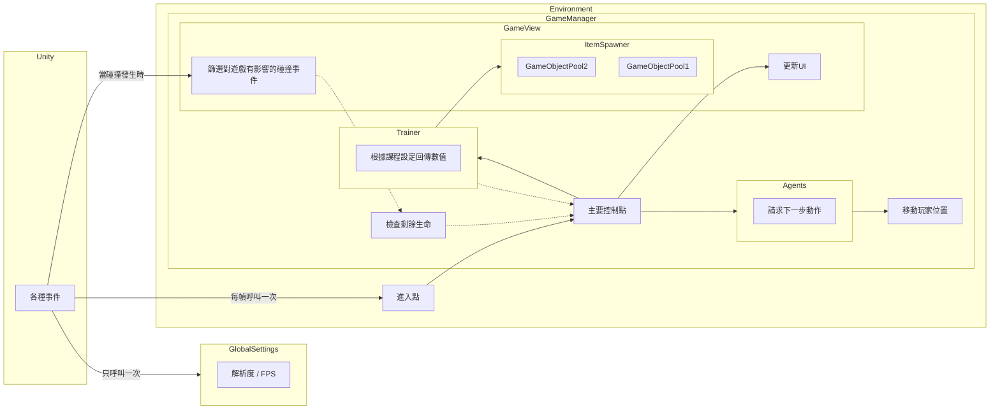

**[English document](README.md)**  
**[日本語ドキュメント](README.jp.md)**  

# 概要
這是個測試Unity的AI工具做的小專案。內含一個受到「特訓99」啟發的彈幕遊戲，在遊戲中存活越久可以獲得更高的分數。本專案包含兩種不同的AI可以代替玩家自動操控。

# 遊戲畫面
  
  

遊戲實際運行的影片如下  
新型AI：[深度學習](https://www.youtube.com/watch?v=XKedSg2ElY0)  
舊型AI：[手刻AI的影片](https://www.youtube.com/watch?v=z9VtiN43LhQ)  

# 簡介
這份文件記錄了在這個專案學到的經驗。如果你對彈幕遊戲的AI有興趣的話，這份文件也許可以當作參考。

本專案包含有兩種AI
  - [手工AI (基於規則系統)](#手工ai-基於規則系統)
  - [DRL Agent (深度增強式學習代理人)](#drl-agent-深度增強式學習代理人)

## Agent (代理人)
在AI的領域中，察覺環境變化並做出反應的角色稱為[Agent](https://en.wikipedia.org/wiki/Intelligent_agent) (代理人)，例如機器人、遊戲中的玩家可操控角色等等  
由於中文的代理人聽起來不是很直覺，接下來統一會以Agent稱呼這個角色

### 手工AI (基於規則系統)
為了比較不同Agent之間的表現，我寫了一個手工AI做為基礎的比較對象
這類AI是由程式設計師將腦中的想法用程式實現出來的系統，相較於深度增強式學習是古老的AI技術  

這個專案中的手工AI內含4種策略
  - 暴食
    - 積極嘗試獲得道具（1-up）以存活更長時間
  - 鄉愁
    - 偏好待在畫面中心，因為待在角落比較容易被逼入死角
  - 牆壁恐懼症
    - 遊戲中碰到邊界時就會直接結束，應該要盡可能遠離邊界
  - 近距離閃避
    - 面對近距離的子彈時嘗試左右閃避
    - 如果距離太近則稍微向後移動爭取空間，直到來得及左右閃避為止

每種策略都會給出一個方向和信心值作為建議。信心值取決於緊急程度、例如牆壁恐懼症在靠近邊界時會給出更高的信心值。

這個系統的運作方式有點像議會制，Agent會選擇信心值最高的策略並將其方向回傳給遊戲。值得注意的是，信心值函數是根據實驗調整出來的結果，並沒有任何理論基礎。且因為「調整」是手工做的，並不是真正最佳化過的結果。

### DRL Agent (深度增強式學習代理人)
DRL代表深度增強式學習(Deep Reinforcement Learning)，以下會用DRL Agent稱呼這個方式訓練出來的Agent。  

訓練的工具是Unity的[ML-Agents Toolkit](https://github.com/Unity-Technologies/ml-agents)。

### 獎勵函數
你需要告訴AI什麼樣的結果是好，什麼樣的結果是不好，AI才有辦法在訓練之中漸漸地往好的方向發展，而這些判斷標準就是[獎勵函數](https://en.wikipedia.org/wiki/Reinforcement_learning#Introduction)。雖然說獎勵函數是DRL的**關鍵**，但眾所皆知設計適當的獎勵函數並不是一件容易的事。除了基本的獎勵像是+1（獲得1-up）或-1（撞到邊界），我還借用了一些開發手工AI時得到的靈感，例如靠近邊界或是子彈時也會被扣分之類的負面獎勵。由於使用這些獎勵引導Agent很容易導致[reward hacking](https://en.wikipedia.org/wiki/AI_alignment#Specification_gaming_and_side_effects)的問題，我還採用了[potential-based reward shaping](https://gibberblot.github.io/rl-notes/single-agent/reward-shaping.html#potential-based-reward-shaping)的技巧確保獎勵函數不會造成問題。詳細的實作請參考[DRLAgent.cs](Assets/Scripts/AI/DRLAgent.cs)。

實際進行DRL訓練之前先準備一些簡易Agent(例如前述的手工AI)可以讓訓練更順利。簡易Agent可以當作一個比較用的低標，訓練過的DRL Agent表現應該要比簡易Agent更好，如果沒有的話表示訓練方向錯誤。另外，如果先把它們的行為紀錄下來，還可以再使用Unity提供的[GAIL](https://unity-technologies.github.io/ml-agents/ML-Agents-Overview/#gail-generative-adversarial-imitation-learning)和[behavior cloning](https://unity-technologies.github.io/ml-agents/ML-Agents-Overview/#behavioral-cloning-bc)這類模仿學習(imitation learning)的工具，幫助Agent快速找到正確的方向並縮短訓練的時間。但要注意模仿學習同時會干擾訓練，建議在DRL Agent學到一些成果後把強度參數調低。  

有點可惜的是Unity沒有提供[inverse reinforcement learning](https://en.wikipedia.org/wiki/Reinforcement_learning#Inverse_reinforcement_learning)的工具。其實前述的手工AI的表現還算堪用，有這個工具就可以直接學出一個獎勵函數，不用自己在設計獎勵函數時猜個老半天。  

## 訓練過程
### 嘗試更多種設定並進行比較
Agent表現不如預期其實非常常見。可惜的是背後有非常多可能的原因（超參數、獎勵函數、不穩定的環境等等），你很難找到誰是罪魁禍首。為此我嘗試了各式各樣的設定並從中選了表現比較好的。以下是我試過的結果
  - [訓練演算法](https://github.com/Unity-Technologies/ml-agents/blob/main/docs/ML-Agents-Overview.md#deep-reinforcement-learning)
    - PPO
      - 跟其他演算法比較起較穩定，容易使用
      - 適合初學者
      - 這個專案用的是這個演算法
    - SAC
      - 試了一陣子之後放棄了，Unity的實作似乎有點問題
      - 訓練中跳出某些警告(warning)之後，訓練忽然變慢到無法接受的程度
      - PPO也會跳出同樣的警告但沒有變慢
  - 網絡設置
    - 2 layer + 128 units
    - 3 layer + 256 units
    - 初步實驗顯示小網路收斂比較快且更穩定
  - Agent的移動方式
    - 雖然原本玩家可以往任意方向移動，但將移動離散化可以加快訓練過程
    - 從x=[-1, 1], y=[-1, 1]的連續範圍改成時鐘的12個方向，再加上一個原地不動共13種
    - 只要每次移動的距離不大，離散移動的結果和連續移動的結果不會差太多
  - 獎勵函數
    - 從基本的+1/-1再加上前面提到的[potential-based reward shaping](#獎勵函數)
  - 批次大小 (batch size)
    - 坦白說感覺不出差別
    - 選了較大的大小（512）
  - 緩衝區大小 (buffer size)
    - 選了較大的大小（409600）
      - 訓練速度較慢但更穩定
      - 詳見[訓練時間](#訓練時間)
  - 訓練環境
      - 設計了訓練專用的特殊關卡，讓Agent有更多失敗並可以重新嘗試的機會
      - 參見[curriculum training](#curriculum-training)

### Curriculum Training (課程訓練)
[Curriculum training](https://github.com/Unity-Technologies/ml-agents/blob/main/docs/ML-Agents-Overview.md#solving-complex-tasks-using-curriculum-learning)在DRL是個常見的技巧，有助於讓Agent學得更快。

這個專案中包含5種課程
  - Border
    - 讓代理知道邊界在哪裡
      - 沒子彈
      - 在開始前將Agent放在邊界旁邊
        - 用容易失敗的例子教導Agent「失敗」的概念，並懂得如何避免這個狀況
  - Simple
    - 讓Agent知道如何閃避子彈或收集1-up
      - 同時只會有2個道具
      - 把Agent放在畫面中央
      - 朝向Agent的位置發射道具
  - Normal
    - 讓Agent習慣有更多道具的環境
    - 每隔一段時間產生道具
    - 朝向畫面中心範圍隨機發射道具
    - 初始生命設定為10
      - 確保Agent活久一點並有機會嘗試各種狀況
  - Mix
    - 確保代理還記得上述課程中的目標
    - 從上述課程中隨機選擇一個作為本次訓練內容
      - 這是為了避免[災難性遺忘(Catastrophic Forgetting)](https://en.wikipedia.org/wiki/Catastrophic_interference)的應急方法
        - 沒辦法根本解決問題，但至少有點幫助
      - 由於環境之間差異很大，比其他課程難訓練很多
    - 在開始這個課程之前，最好確定Agent在上述課程中已經達成預期的目標
  - Increasing
    - 對應到真實的遊戲環境
    - 類似Normal課程但更難
    - 道具會隨著時間越來越多
    - 初始生命設定為30

每個課程Agent都需要訓練到收斂然後才繼續下一個課程。[Tensorboard](https://unity-technologies.github.io/ml-agents/Using-Tensorboard/)可以用來幫忙判斷當前是否已經收斂。

雖然Unity也有提供curriculum training，但考量到下列幾點我偏向不使用這個功能
1. 它是用步數(step)和完成次數(lesson)判斷是否要進到下個課程，但這兩個指標都不能保證訓練已經收斂，建議還是用Tensorboard自己看
2. 作為災難性遺忘的應急手段，你可能會想要用已經訓練過的課程再反覆訓練
  - 雖然已經有人提出[一些解決方法](https://pub.towardsai.net/overcoming-catastrophic-forgetting-a-simple-guide-to-elastic-weight-consolidation-122d7ac54328)，但Unity沒有實作這些演算法
  - 重新訓練還是有點用

相較之下，為不同的課程寫各自的[設定文件](https://github.com/Unity-Technologies/ml-agents/blob/main/docs/Training-Configuration-File.md#training-configuration-file)會比較有彈性

### 訓練表現不佳 & 改善方法
在訓練Simple和Normal的課程時，雖然Simple最後收斂時的表現符合預期，但Normal卻沒有如預期地收斂。進一步觀察後推測問題來自於子彈和1-up兩種道具會同時出現。這個環境下的最佳策略是閃躲子彈或是收集1-up，但閃躲和收集卻是兩種完全相反的策略。由於Simple的課程中道具數量少，基本上只要一開始從中二選一就是最佳解。但Normal的道具較多，就算收集1-up也有可能會撞到旁邊的子彈，Agent必須迅速在這兩種完全相反的策略中切換，導致Agent無法發展出清晰的策略。  

為了解決這個問題我把訓練分成兩輪。第一輪的所有課程都**不包含1-up**，持續訓練直到所有課程都完成為止，此時Agent已能充分掌握閃躲子彈的技巧。由此再進行有包含1-up的第二輪課程。由於Agent已經有足夠的閃躲經驗，收集1-up時也比較不會撞到旁邊的子彈，結果會比第一輪就加入1-up訓練更好。

### 訓練時間
訓練時間取決於你的專案類型，不過大致上都要花不少時間。下列是訓練過程中得到的一些經驗。

PPO的演算法有兩個步驟。首先在Unity取樣，然後取得夠多樣本後再更新模型。
  - 取樣
    - CPU要負責執行Unity的環境。同時執行多個實例時負擔較高
    - GPU只做模型的推論(inference)。推掄本身的負擔較低
    - 以這個專案為例，這個階段大約需要2分鐘
    - 增加[訓練環境](https://github.com/Unity-Technologies/ml-agents/blob/main/docs/Training-ML-Agents.md#training-using-concurrent-unity-instances)的數量可以加快取樣
      - 這方法會大量占用硬體資源，特別是CPU和記憶體
      - 先把訓練環境做成一個prefab，然後就可以大量複製成多個訓練環境的實例
        - 你要確保你的程式可以同時執行多個實例不會出錯
        - 如果這件事對你來說太難，你也可以在訓練時改用`--num-env`來一次執行多個Unity實例，但理論上訓練會比使用prefab慢
  - 更新模型
    - CPU此時不做事，Unity環境暫停
    - GPU負責大量計算，負擔較高
    - 以這個專案為例，這個階段大約需要6分鐘
    - 不知道為什麼，GPU的使用率不到100%
      - 只要GPU使用率不到100%，你可以同時跑多個不同的訓練
      - DRL有很多因素會影響最後結果，建議你同時嘗試各種不同的設定然後從中挑選比較好的

本專案用的GPU是RTX 3060 12GB。由於每個課程之間難度不同，訓練所需的時間也有所不同。以下是一些訓練過程的紀錄，失敗的就沒列出來了。
1. Border
  - 
  - 220萬步
  - 28分鐘
2. Simple
  - 
  - 2000萬步
  - 7小時
3. Normal
  - 
  - 3000萬步
    - 1千萬步左右的時候就差不多收斂了，其實可以提早結束
  - 10.5小時
4. Mix
  - 
  - 6350萬步
    - 因為環境差異太大，嚴格來說沒收斂
  - 23小時
5. Increasing
  - 
  - 2.8億步
    - 還沒收斂
    - 實際測試表現比手工AI更好，決定停止
  - 120小時
    - 訓練過程中發生了一些意外
      - 我的電腦記憶體用完了導致訓練中斷，共發生3次
      - 每次中斷再回復(resume)都會導致數值顯著惡化
        - 從最後一次中斷(2.6億步附近)開始又花了24小時才回到原本的進度
        - 不確定是不是Unity工具的問題

### Tensorboard
Tensorboard可以幫忙判斷訓練是否已經收斂，然後決定要不要停止訓練。
- Environment/Cumulative Reward
  - 經由獎勵函數獲得的數值
  - Unity的工具的最終目的是最大化這個值
    - 如同[獎勵函數](#獎勵函數)所提到的，這個指標可能包含一些對Agent有益(獲得1-up)，但跟最終目標(生存時間)不一定有關係的成分
    - 這可能會導致Unity想要最佳化的方向跟你想的不同
    - 你必須非常清楚那些Agent做了哪些行為貢獻到這個指標，Agent是否有真的有隨著數字的增加而朝著你想要的方向發展，否則可能會變成[reward hacking](https://en.wikipedia.org/wiki/AI_alignment#Specification_gaming_and_side_effects)
  - 實際資料  
      
- Environment/Episode Length
  - 代表Agent在Normal和Increasing的課程中存活多久
  - 這才是評估Agent表現的**真實**指標，因為我們設定的最終目標是存活更久
    - 取得1-up會讓獎勵上升，但卻不一定能讓Agent存活更久
      - 例如為了拿到一個1-up卻闖入一群子彈之中，然後撞到更多子彈
  - 實際資料  
      
    這張圖跟上面的Cumulative Reward的趨勢幾乎一模一樣，這是件好事。這代表Agent最佳化的方向跟我們希望的目標一致

使用額外的自訂指標可以幫助診斷問題在哪裡。下列是在訓練Mix的課程中的實際過程。
- OutofBounds
  - 撞到邊界時+1
    - 越低越好
    - 應該隨著訓練遞減
    - 實際資料  
        
      平均每一百萬步只發生不到一次(背景的淺藍色線)，表現不錯
- Hits
  - 撞到任何類型的子彈時+1
    - 越低越好
    - 應該隨著訓練遞減
    - 實際資料  
        
      剛開始Agent正在探索各種可能的選擇所以有可能表現不佳，但只要最後的結果是遞減並收斂就算成功。
- OneUps
  - 獲得1-up時+1
    - 越高越好
    - 應該隨著訓練遞增
    - 實際資料  
        
      雖然趨勢是遞減，跟理想上應該遞增有所不同，但同時觀察上一項的Hits也是在遞減而且趨勢更明顯。可以推測比起收集1-up，Agent更偏向優先閃避子彈。這種狀況也是可以接受的

## 實作設計
為了加速訓練，這個專案被設計成可以一次執行多個訓練環境 (`Environment.cs`)，且讓各個環境之間不會彼此互相干擾。  
另外，為了減少除錯時的負擔，實作劃分為流程控制邏輯 (`GameManager.cs`) 和顯示邏輯(`GameView.cs`)兩大部分各司其職。階層上GameManager可以直接操控GameView，但GameView只能用event回饋給GameManager。這樣可以避免複雜的互相依賴關係。
### 架構圖

## 銘謝
本專案使用了以下工具及素材
- 遊戲引擎
  - [Unity](https://unity.com/)
- 3D模型
  - 修改自: [Low Poly Spaceships](https://sketchfab.com/3d-models/low-poly-spaceships-9177fe4356e4451485dc6129c9904eb9)  
- 背景圖片
  - 使用Stable diffusion產生
  - 使用的Model為: [Realistic Vision 2.0](https://civitai.com/models/4201/realistic-vision-v20)

## 參考資料
### Unity官方文件
[Getting Started Guide](https://github.com/Unity-Technologies/ml-agents/blob/main/docs/Getting-Started.md)  
[Making a New Learning Environment](https://github.com/Unity-Technologies/ml-agents/blob/main/docs/Learning-Environment-Create-New.md)  
[Training Configuration File](https://github.com/Unity-Technologies/ml-agents/blob/main/docs/Training-Configuration-File.md)

### 延伸閱讀
[深度强化学习调参技巧：以D3QN、TD3、PPO、SAC算法为例](https://zhuanlan.zhihu.com/p/345353294)  
[如何选择深度强化学习算法？MuZero/SAC/PPO/TD3/DDPG/DQN/等](https://zhuanlan.zhihu.com/p/342919579)